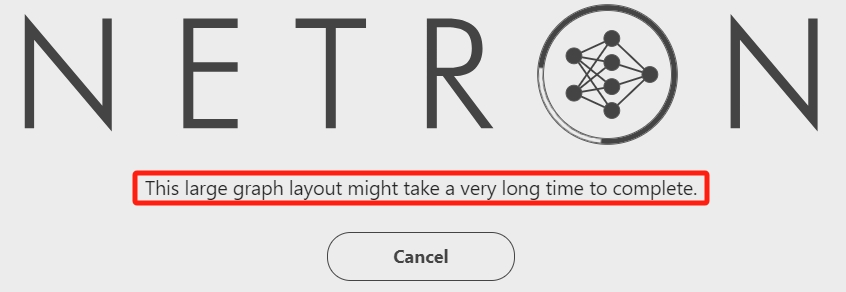
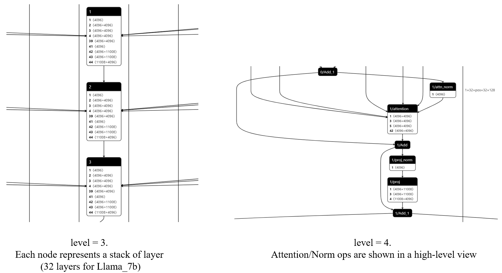

[netron](https://github.com/lutzroeder/netron) is great. However, it struggles for models with a large number of nodes. Too much time is consumed for graph rendering, which causes the visualization to get stuck.

<center>
 
</center>

Then [netron-hierarchy](https://github.com/ZhangGe6/netron-hierarchy) comes to help. `netron-hierarchy` is based on the observation that deep learning models can be seen in a hierarchy view. More specifically:

1. DL models are generally stacks of the same blocks. We can say, a DL model is composed of N blocks;
2. Each block is composed of several high-level layers, like `Attention`, `LayerNorm`;
3. ...
4. In the most fine-grained view, each layer is composed of "atomic" modules, such as `Linear`, and `Add`.

The higher the hierarchy is, the coarser the node grainity is. We can view the model graph from an overview perspective, and most importantly, the number of nodes is reduced dramatically, relieving the stress of graph rendering.

This project is built based on [netron commit-id a064ed6](https://github.com/ZhangGe6/netron-hierarchy/commit/a064ed62b6df7150e35a96f9abc760b923e27ade) and is at its (very) early stage. Now only a Python prototype for ONNX is built as a model preprocessor before feeding to netron. These logics will be integrated into netron codebase for an out-of-box experience soon.

To generate model with a specific hierarchy, we can run
```bash
cd prototype

python hierarchy.py -i path/to/model -l hierarchy [-o path/to/save]
```

Take the [LlamaV2_7B_float16.onnx](https://huggingface.co/alpindale/Llama-2-7b-ONNX/resolve/main/FP16/LlamaV2_7B_float16.onnx?download=true) as example, specify "hierarchy" as 3, we can get a model in a "block-wise" view. And specify "hierarchy" as 4, we can get a model in a "(high-level-)layer-wise" view.

