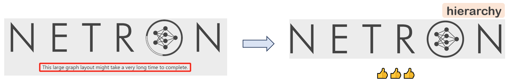
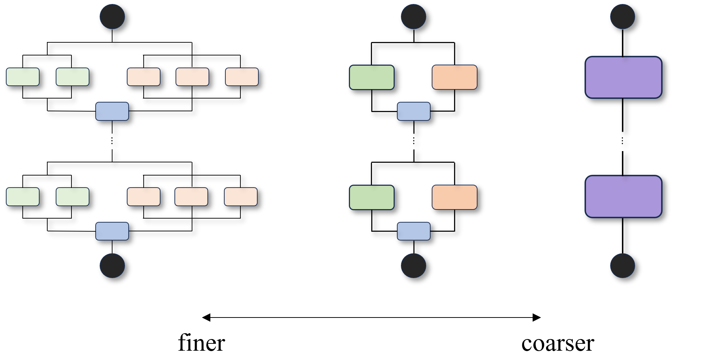
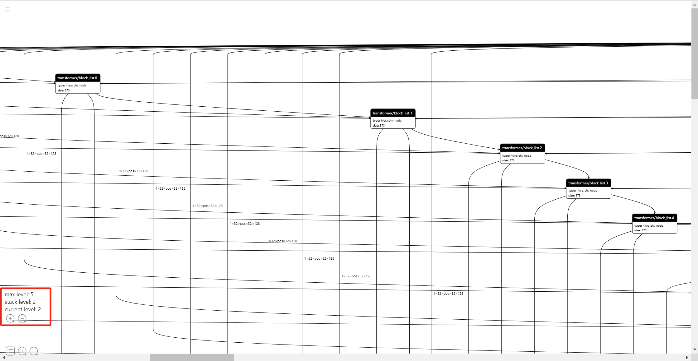
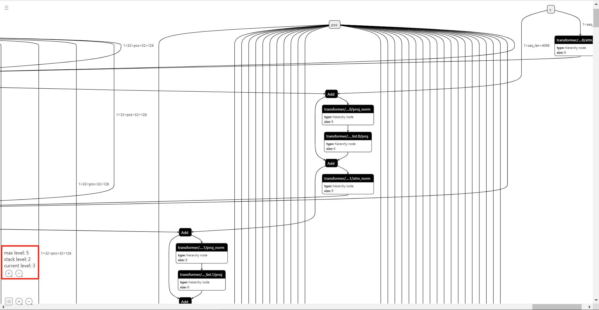

# Introduction

[netron](https://github.com/lutzroeder/netron) is great. However, it struggles for models with a large number of nodes. Too much time is consumed for graph rendering, which causes the visualization to get stuck.

<center>
 
</center>

Then [`netron-hierarchy`](https://github.com/ZhangGe6/netron-hierarchy) comes to help. It is based on the observation that deep learning models can be viewed in a hierarchical way. More specifically:

- Deep learning models are generally stacks of the same blocks;
- Each block is composed of several high-level layers, like `Attention`, `LayerNorm`;
- In the most fine-grained view, each layer is composed of "atomic" modules, such as `Linear`, and `Add`.

<center>
 
</center>

The higher the hierarchy is, the coarser the node grainity is. `netron-hierarchy` enables us to visualize models in a specified hierarchy and switch between hierarchies. When too many nodes are detected in a hierarchy, stacks except the 1st one will be folded automatically, to avoid graph rendering hang. As a bonus, hierarchical visualization helps us understand the model topology better.

`netron-hierarchy` is built based on netron. Hope it helps!

# Get started
Clone the repo and launch the application
```bash
git clone https://github.com/ZhangGe6/netron-hierarchy.git
cd netron-hierarchy

python package.py build start --browse
```
Then `netron-hierarchy` will be hosted in `http://localhost:8080` automatically in the web browser.

# Usage

Currently, `netron-hierarchy` parses hierarchy level from node names. So ensure the node names of the provided model have patterns like
```
XXX/block_list.[X]/...
or
XXX/layer.[X]/...
```
Take the [LlamaV2_7B_float16.onnx](https://huggingface.co/alpindale/Llama-2-7b-ONNX/resolve/main/FP16/LlamaV2_7B_float16.onnx?download=true) as example (Yes, LLM models can be opened!), the following images show the model graph of hierarchy 2 and 3, respectively. Hitting "+" or "-" to switch hierarchy levels.



